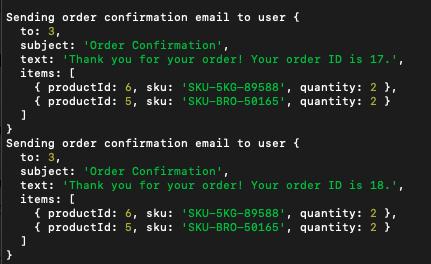

# Project Documentation

## Table of Contents

1. [Introduction](#introduction)
2. [Architecture Overview](#architecture-overview)
3. [Project Structure](#project-structure)
4. [Installation and Setup](#installation-and-setup)
5. [Running the Application](#running-the-application)
6. [Available Scripts](#available-scripts)
7. [Environment Configuration](#environment-configuration)
8. [API Documentation](#api-documentation)
9. [Testing](#testing)
10. [Summary](#summary)
11. [Last Notes](#last-notes)

## Introduction

This project is a Point of Sale (POS) system designed to manage products, orders, and related services. The architecture is designed with scalability and maintainability in mind, leveraging microservices, RabbitMQ for messaging, and a monorepo structure for organizing the codebase.

## Architecture Overview

### Why Microservices?

Microservices architecture was chosen to meet the following requirements:

- Scalability: Each service can be scaled independently based on its load.
- Maintainability: Clear separation of concerns makes the codebase easier to manage.
- Resilience: Failure in one service does not affect the entire system.

### Key Components

- **NGINX**: Acts as a gateway, routing requests to appropriate services.
- **RabbitMQ**: Used for messaging between services to ensure decoupled and asynchronous communication.
- **Consul**: Provides service discovery and health checking.
- **Consul-template**: Used for dynamic configuration of services based on Consul data.
- **Express and Sequelize**: Used as framework and ORM for database interactions with MySQL.
- **Auth Service**: Manages user authentication and authorization.
- **Product Service**: Handles product-related operations like creation, update, and deletion.
- **Order Service**: Manages orders, tracks order status, and updates product inventory.
- **Notification Service**: Receives events from other services via RabbitMQ and handles notifications, for now its just receives events print them out.
  

List of events being triggered (so far 😎):

- order creation
- order updates
- low stock

## Project Structure

>    <root>

    ./
    ├── services
    │   ├── auth-service
    │   ├── product-service
    │   ├── notification-service
    │   ├── orders-service
    ├── docs
    ├── scripts
    │   ├── runDatabase.sh
    │   ├── runDocker.sh
    │   ├── generateKeys.sh
    ├── docker
    │   ├── consul
    │   ├── consul-template
    │   ├── nginx
    │   ├── docker-compose.base.yml
    │   ├── docker-compose.prod.yml
    │   ├── docker-compose.dev.yml
    ├── configs
    │   ├── eslint
    │   ├── prettier
    │   ├── tsconfig
    ├── libs
    │   ├── event-bus
    │   ├── middlewares
    │   ├── interfaces
    │   ├── service-register
    │   ├── api-service
    ├── docker-compose.yml
    ├── README.md
    └── startUp.sh

## Installation and Setup

### Prerequisites

- Node.js (>= 20.x)
- Docker and Docker Compose
- PNPM (package manager)

### Setup Script

A shell script `./startUp.sh` is provided to automate the setup process.

_Sneak peek of the script_:

```bash
#!/bin/bash

# Check if Node.js is installed
if ! command -v node &> /dev/null
then
    echo "Node.js is not installed. Please install Node.js to continue."
    exit 1
fi

# Install all dependencies via pnpm
pnpm install

# Copy .env.example to .env for each service
for service in ./services/*; do
    if [ -d "$service" ]; then
        cp "$service/.env.example" "$service/.env"
    fi
done

echo "🥳🎉 Setup completed successfully. You can now access the services. 🎉🥳"
```

To run the setup script:

```bash
%: chmod +x ./startUp.sh
%: ./startUp.sh
```

Incase for whatever reason `./startUp.sh` is not working all the way through, please run the following script first:

```bash
%: chmod +x ./scripts/runDocker.sh
%: ./scripts/runDocker.sh dev up --build -d
```

To shut down the server simply run:

```bash
%: ./scripts/runDocker.sh dev down
```

## Environment Configuration

Each service requires an environment configuration file (.env). An example configuration is provided in .env.example files in each service directory. However, creation of this is automated with the `./startUp.sh` script.

## API Documentation

API documentation is provided as a Postman collection. You can find the collection here: `./docs/Point-of-Sale.postman_collection.json`.

### Postman Collection

1. Open Postman.
2. Go to File > Import.
3. Click on folders in the opened modal and select the Postman collection file from the docs folder.
4. Once imported, you will see all the APIs organized and ready to use.

## Testing

### Tools:

- Jest
- Supertest
- Sinon

### Running tests

To run tests for all services: `npm run test` or `npm run test:all`

But in case you want to run individually:

- **Auth service**: `npm run test:auth`
- **Order service**: `npm run test:order`
- **Product service**: `npm run test:product`

## Summary

Throughout the development of this project, several key decisions were made to ensure it met the requirements and was scalable, maintainable, and resilient.

1. **Microservices Architecture**: This was chosen to allow independent scaling of services and to ensure that failures in one service do not impact the entire system. Each service handles a specific business domain, such as authentication, products, orders, and notifications.
2. **Messaging with RabbitMQ**: RabbitMQ was used to facilitate asynchronous communication between services, making the system more robust and decoupled. This ensures that services can communicate without direct dependencies on each other.
3. **Service Discovery with Consul**: Consul was integrated for service discovery and health checking. This allows services to find each other dynamically and ensures that only healthy services are included in the service pool.
4. **Consul-template for Dynamic Configuration**: Consul-template was used to generate configuration files dynamically based on the data in Consul. This allows for more flexible and dynamic service configurations.
5. **Sequelize and MySQL**: Sequelize was chosen as the ORM for database interactions due to its robust features and ease of use with MySQL. This decision was based on the need for a reliable and scalable database solution.
6. **Testing with Jest, Supertest, and Sinon**: Comprehensive testing was implemented using Jest for unit tests, Supertest for integration tests, and Sinon for mocking and spying. This ensures that the system is reliable and that changes can be made confidently.
7. **Documentation and API Collections**: Detailed documentation was provided along with Postman and Insomnia collections to make it easy for developers to understand and use the APIs.

By following these design principles and leveraging the right tools, the project achieves a balance of performance, reliability, and ease of maintenance. The setup scripts and Docker configuration ensure that the project can be easily set up and run in any environment, making it a robust solution for the given requirements.

## Last Notes

If there's are any question please reach out to me via: hanisikuhle@gmail.com
